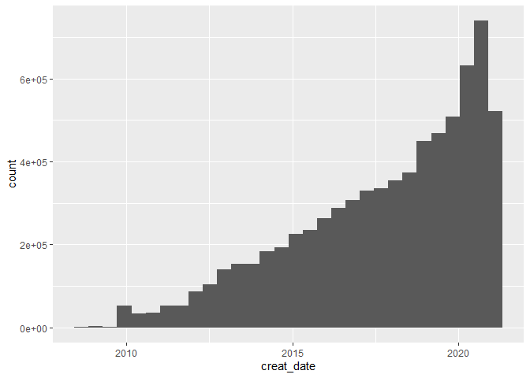
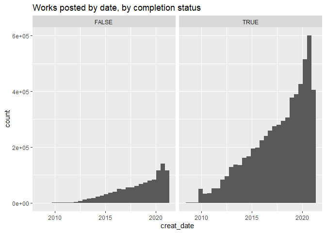
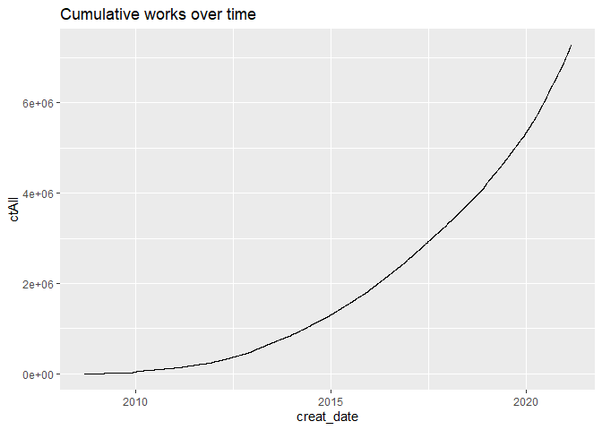
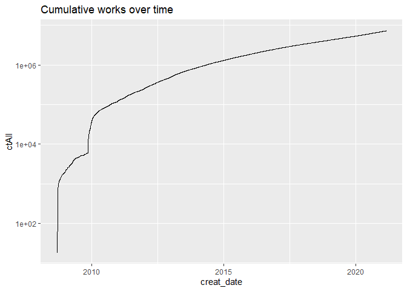
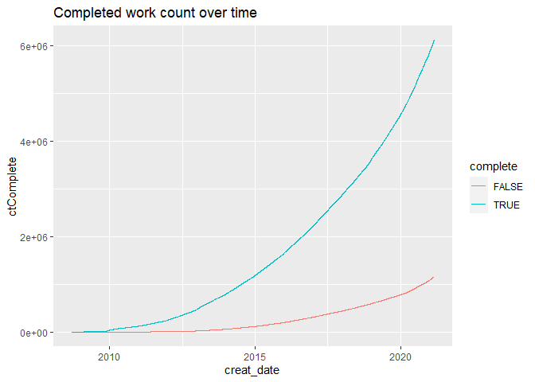
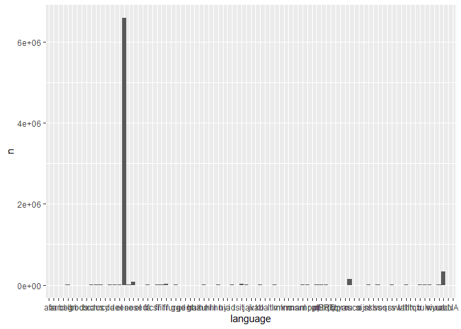
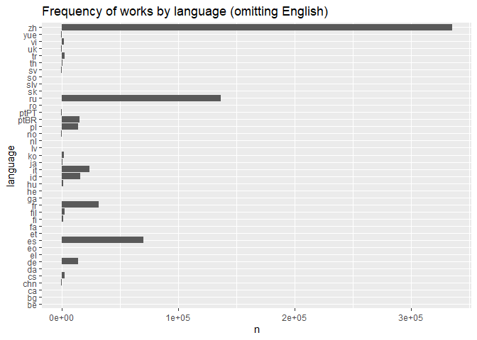
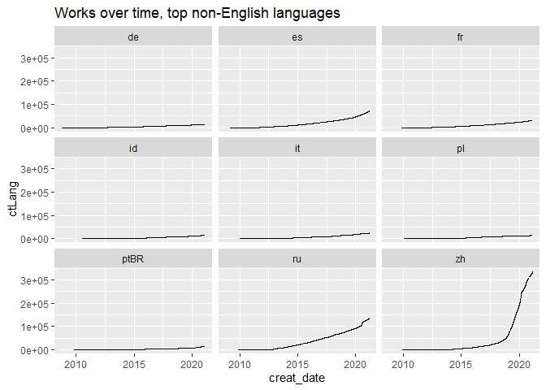

## Import data

Before this file, I ran `data_import_save.R`, which does minimal cleaning on the original CSV files and then exports them into `.Rda` format (loads faster, takes less disk space). 


## Basic initial plots

### Number of works posted by date

First, I was curious about the works posted over time, as a whole and then by restricted and completed status. There are 7269693 works listed in the file.

<!-- -->

By complete/incomplete, the numbers are:


```
## # A tibble: 2 x 3
##   complete       n  frac
##   <lgl>      <int> <dbl>
## 1 FALSE    1158473 0.159
## 2 TRUE     6111220 0.841
```

<!-- -->

By restricted/unrestricted (here, plotting fraction of works rather than raw number, or the restricted data gets totally squashed)


```
## # A tibble: 2 x 3
##   complete       n  frac
##   <lgl>      <int> <dbl>
## 1 FALSE    1158473 0.159
## 2 TRUE     6111220 0.841
```

<!-- -->

Slightly interesting that restricted works don't seem to increase at the same rate. Maybe the pandemic makes people less shy? Who knows. 


### Cumultative works over time

Next, I'm curious how the total evolved over time. This is easier if I start by accumulating the counts of each work type. 


```
## # A tibble: 7,269,693 x 9
##    creat_date language restricted complete word_count tags      ctAll ctComplete
##    <date>     <chr>    <lgl>      <lgl>         <dbl> <chr>     <int>      <int>
##  1 2008-09-13 en       FALSE      TRUE           1836 123+124+~     1          1
##  2 2008-09-13 en       FALSE      TRUE           1338 112+113+~     2          2
##  3 2008-09-13 en       FALSE      TRUE           1755 77+78+69~     3          3
##  4 2008-09-13 en       FALSE      TRUE           1392 78+77+84~     4          4
##  5 2008-09-13 en       TRUE       TRUE            705 78+77+84~     5          5
##  6 2008-09-13 en       TRUE       TRUE           1583 78+77+84~     6          6
##  7 2008-09-13 en       TRUE       TRUE          30830 13+93+23~     7          7
##  8 2008-09-13 en       FALSE      TRUE           2482 87+88+23~     8          8
##  9 2008-09-13 en       FALSE      TRUE          52843 84+23+13~     9          9
## 10 2008-09-13 en       FALSE      TRUE            733 79+80+82~    10         10
## # ... with 7,269,683 more rows, and 1 more variable: ctRestrict <int>
```

The cumulative plot of all works over time looks like this. Second version was to see how exponential it was (answer: meh). 

<!-- --><!-- -->

Then repeat, breaking out by complete/incomplete: 

<!-- -->

And restricted/unrestricted: 

<!-- -->


## Language frequency

Just plotting work frequency by language isn't super helpful, because English is too common. 

<!-- -->

If you filter that away, the axis labels are still hard to read. There are 87 different languages represented! Here, I set an arbitrary threshold of at least 50 works to display.

<!-- -->

Next, I was curious about development over time. First, filter down to the most frequent languages, excluding English: 


```
## # A tibble: 10 x 3
##    language       n    frac
##    <chr>      <int>   <dbl>
##  1 en       6587693 0.906  
##  2 zh        335179 0.0461 
##  3 ru        136724 0.0188 
##  4 es         70645 0.00972
##  5 fr         32145 0.00442
##  6 it         24261 0.00334
##  7 id         16015 0.00220
##  8 ptBR       15336 0.00211
##  9 de         14426 0.00198
## 10 pl         14261 0.00196
```

I cut off at 10 because it's a round number, but it also turns out there's a natural breakpoint--the next most frequent after Polish (14261 works) is Turkish, with substantially fewer (2984) works. 

<!-- -->

The really visible thing here is the big jump, ramping up a few years ago, in the frequency of Chinese-language (`zh`) works. To get a slightly better look at that and how it compares to the other growth rates, let's try one more: 

<!-- -->

The Chinese-language section has been growing faster than many other languages for a bit, starting around 2012 and with another change for the steeper around 2018-2019. 
