## Import data

Before this file, I ran `data_import_save.R`, which does minimal cleaning on the original CSV files and then exports them into `.Rda` format (loads faster, takes less disk space). 


## Basic initial plots - Works

### Number of works posted by date

First, I was curious about the works posted over time, as a whole and then by restricted and completed status. There are 7269693 works listed in the file.

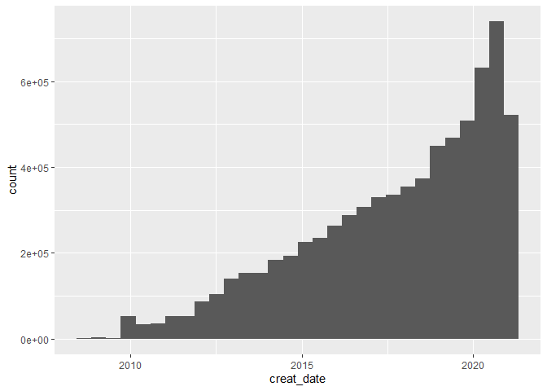<!-- -->

By complete/incomplete, the numbers are:


```
## # A tibble: 2 x 3
##   complete       n  frac
##   <lgl>      <int> <dbl>
## 1 FALSE    1158473 0.159
## 2 TRUE     6111220 0.841
```

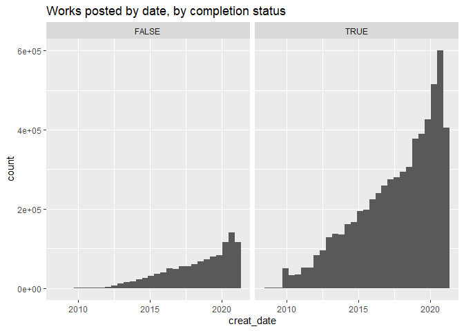<!-- -->

By restricted/unrestricted (here, plotting fraction of works rather than raw number, or the restricted data gets totally squashed)


```
## # A tibble: 2 x 3
##   complete       n  frac
##   <lgl>      <int> <dbl>
## 1 FALSE    1158473 0.159
## 2 TRUE     6111220 0.841
```

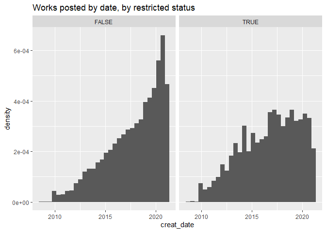<!-- -->

Slightly interesting that restricted works don't seem to increase at the same rate. Maybe the pandemic makes people less shy? Who knows. 


### Cumultative works over time

Next, I'm curious how the total evolved over time. This is easier if I start by accumulating the counts of each work type. 


```
## # A tibble: 7,269,693 x 9
##    creat_date language restricted complete word_count tags      ctAll ctComplete
##    <date>     <chr>    <lgl>      <lgl>         <dbl> <chr>     <int>      <int>
##  1 2008-09-13 en       FALSE      TRUE           1836 123+124+~     1          1
##  2 2008-09-13 en       FALSE      TRUE           1338 112+113+~     2          2
##  3 2008-09-13 en       FALSE      TRUE           1755 77+78+69~     3          3
##  4 2008-09-13 en       FALSE      TRUE           1392 78+77+84~     4          4
##  5 2008-09-13 en       TRUE       TRUE            705 78+77+84~     5          5
##  6 2008-09-13 en       TRUE       TRUE           1583 78+77+84~     6          6
##  7 2008-09-13 en       TRUE       TRUE          30830 13+93+23~     7          7
##  8 2008-09-13 en       FALSE      TRUE           2482 87+88+23~     8          8
##  9 2008-09-13 en       FALSE      TRUE          52843 84+23+13~     9          9
## 10 2008-09-13 en       FALSE      TRUE            733 79+80+82~    10         10
## # ... with 7,269,683 more rows, and 1 more variable: ctRestrict <int>
```

The cumulative plot of all works over time looks like this. Second version was to see how exponential it was (answer: meh). 

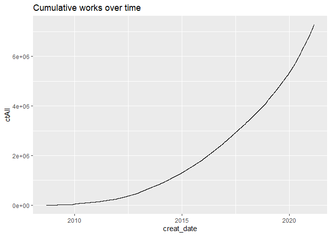<!-- -->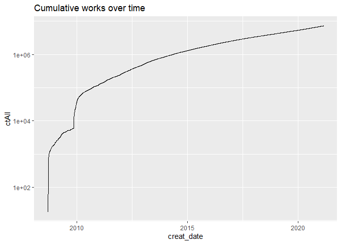<!-- -->

Then repeat, breaking out by complete/incomplete: 

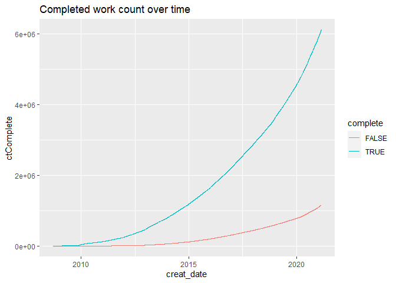<!-- -->

And restricted/unrestricted: 

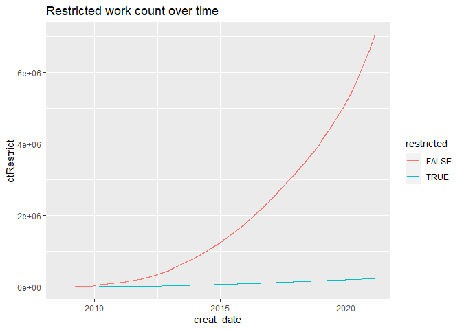<!-- -->


## Language frequency

Just plotting work frequency by language isn't super helpful, because English is too common. 

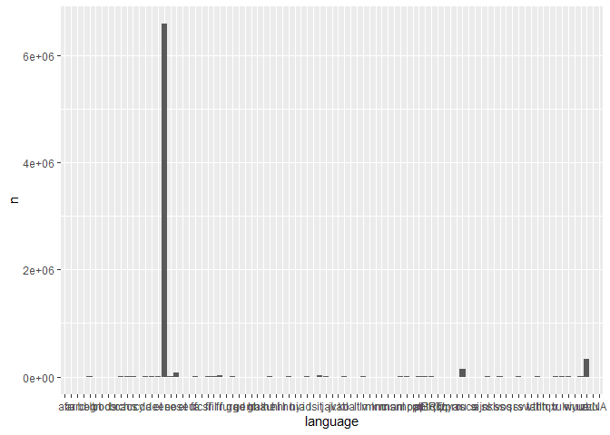<!-- -->

If you filter that away, the axis labels are still hard to read. There are 87 different languages represented! Here, I set an arbitrary threshold of at least 50 works to display.

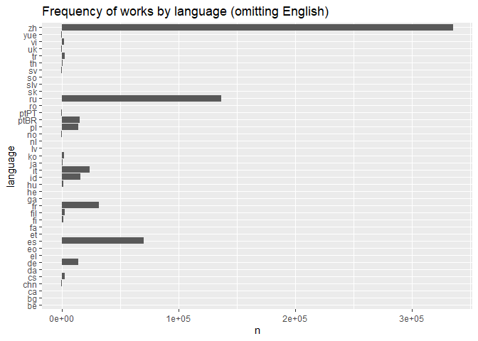<!-- -->

Next, I was curious about development over time. First, filter down to the most frequent languages, excluding English: 


```
## # A tibble: 10 x 3
##    language       n    frac
##    <chr>      <int>   <dbl>
##  1 en       6587693 0.906  
##  2 zh        335179 0.0461 
##  3 ru        136724 0.0188 
##  4 es         70645 0.00972
##  5 fr         32145 0.00442
##  6 it         24261 0.00334
##  7 id         16015 0.00220
##  8 ptBR       15336 0.00211
##  9 de         14426 0.00198
## 10 pl         14261 0.00196
```

I cut off at 10 because it's a round number, but it also turns out there's a natural breakpoint--the next most frequent after Polish (14261 works) is Turkish, with substantially fewer (2984) works. 

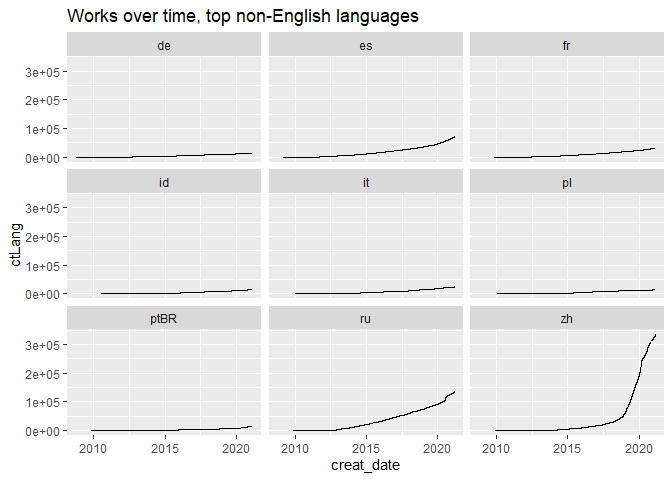<!-- -->

The really visible thing here is the big jump, ramping up a few years ago, in the frequency of Chinese-language (`zh`) works. To get a slightly better look at that and how it compares to the other growth rates, let's try one more: 

<!-- -->

The Chinese-language section has been growing faster than many other languages for a bit, starting around 2012 and with another change for the steeper around 2018-2019. 


## First look - Tags

Now pull in the tags data set and take a look at the most common ones. 


```
## # A tibble: 14,467,138 x 6
##       id type         name                      canonical cached_count merger_id
##    <dbl> <chr>        <chr>                     <lgl>            <dbl>     <dbl>
##  1    16 ArchiveWarn~ No Archive Warnings Apply TRUE           4095298        NA
##  2    23 Category     M/M                       TRUE           3744166        NA
##  3    14 ArchiveWarn~ Choose Not To Use Archiv~ TRUE           2556570        NA
##  4    11 Rating       Teen And Up Audiences     TRUE           2272688        NA
##  5    10 Rating       General Audiences         TRUE           2115153        NA
##  6    22 Category     F/M                       TRUE           1839948        NA
##  7    21 Category     Gen                       TRUE           1423967        NA
##  8    13 Rating       Explicit                  TRUE           1238331        NA
##  9   110 Freeform     Fluff                     TRUE           1183065        NA
## 10    12 Rating       Mature                    TRUE           1151260        NA
## # ... with 14,467,128 more rows
```

Not a surprise that the most common ones are from big categories (archive warnings, ratings, relationship categories). I am amused that Fluff made the top list, though. Makes me wonder if it or any other tags became notably more popular in 2020. 


### Tag type frequency

Other than the most popular, there are some big categories that I don't really have a sense of the shape of: 

* How many tags are unique (vs. having a merger ID)
* How many are listed but not actually used
* What the overall frequency distribution looks like
* How much of the list is Redacted (low-frequency tags, whose names aren't listed)
* How common different rating tags and media types are

Going from the top, any tag row that has a `merger_id` is not a unique tag, but a different listing for an already-existing tag. For example:


```
## # A tibble: 5 x 6
##      id type         name                       canonical cached_count merger_id
##   <dbl> <chr>        <chr>                      <lgl>            <dbl>     <dbl>
## 1    29 Relationship Sam Winchester/Dean Winch~ FALSE             1055        35
## 2    31 Fandom       Redacted                   FALSE                5     25968
## 3    33 Character    Impala - Character         FALSE              581    802294
## 4    37 Fandom       Boondock Saints (1999)     FALSE               47    223663
## 5    45 Relationship Viggo Mortensen/Orlando B~ FALSE               27     12718
```

Tag 29 (Sam Winchester/Dean Winchester) is merged to tag 35 (Dean Winchester/Sam Winchester), the canonical version. I think this might mean canonical tags won't have a `merger_id`? But I can check that. First, the overall prevalence of unique vs. merged tags: 


```
## # A tibble: 2 x 3
##   unique        n  frac
##   <lgl>     <int> <dbl>
## 1 FALSE   3466917 0.240
## 2 TRUE   11000221 0.760
```

About 24% of the tag database is duplicate entries--different spellings or wordings that link back to the same tag. As to my question about if `merger_id` implies that `canonical == FALSE`: 


```
## # A tibble: 4 x 3
##   unique canonical       n
##   <lgl>  <lgl>       <int>
## 1 TRUE   FALSE     9824234
## 2 TRUE   TRUE      1175987
## 3 FALSE  FALSE     3466866
## 4 FALSE  TRUE           51
```

So... not quite, actually! There are 51 canonical tags that still point to a merger. Taking a quick look...


```
## # A tibble: 5 x 6
##       id type         name                     canonical cached_count merger_id
##    <dbl> <chr>        <chr>                    <lgl>            <dbl>     <dbl>
## 1  86955 Character    Moe Tucker               TRUE                 0     87022
## 2 266145 Freeform     Abuse of Shakespeare     TRUE                 3    514794
## 3 308447 Character    Aiden Hall               TRUE                 1   1081273
## 4 341589 Character    Brother - Character      TRUE                32   1008775
## 5 803120 Relationship Dick Grayson/Karen Starr TRUE                 1    412291
```

And then retrieving the first couple to see what they point to:


```
## # A tibble: 2 x 6
##       id type      name                      canonical cached_count merger_id
##    <dbl> <chr>     <chr>                     <lgl>            <dbl>     <dbl>
## 1  87022 Character Maureen Tucker            TRUE                 0        NA
## 2 514794 Freeform  References to Shakespeare TRUE              1276        NA
```

At least in those two cases, both the "base" tag and the one with a `merger_id` are canonical. 

Anyway, moving along to my second question: How many are listed but not actually used?


```
## # A tibble: 1 x 2
##         n   frac
##     <int>  <dbl>
## 1 1363590 0.0943
```

Just under 10% of tags have a `cached_count` of zero. I'm not sure this is actually the same as never being used (see below), and will have to see what happens when I process the tags listing column of the `works` frame.

Next: What does the overall frequency distribution look like? (The answer is "one enormo spike" on the linear scale, so let's look at log-log.)

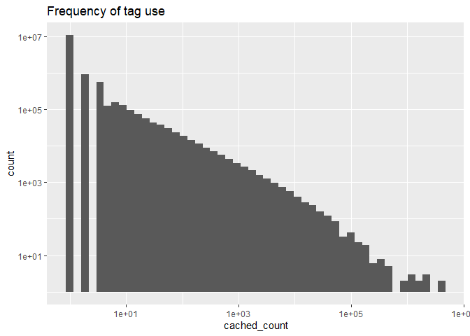<!-- -->

This looks pretty power-law-ish. Most of the tags, more than ten million of them, are used only once (or at least have a `cached_count` of 1). At the other extreme, a handful of tags show up millions of times.


Next question: How much of the list is Redacted (low-frequency tags, whose names aren't listed)? There are at least two ways to ask this--how many of those tags exist, and how commonly they show up in works. Below, the first question is tabulated in `n`, and the second in `cached_count`. 


```
## # A tibble: 3 x 5
##   redacted cached_count        n  cachefrac        nfrac
##   <lgl>           <dbl>    <int>      <dbl>        <dbl>
## 1 FALSE       132680182  1621974 0.904      0.112       
## 2 TRUE         14169098 12845163 0.0965     0.888       
## 3 NA                708        1 0.00000482 0.0000000691
```
The last two columns convert those numbers to a fraction of the total. So redacted (low-use) tags are prolific, almost 90% of the total tag list, which seems plausible if I think about how many tumblr-style one-off notes appear that way. But 90% of the cached count comes from non-redacted AKA higher-frequency tags. And there is a single tag with an `NA` for a name, and 708 uses. Huh. 


Next: How common are different rating tags and media types? Ratings first...


```
## # A tibble: 6 x 3
##   name                  cached_count      frac
##   <chr>                        <dbl>     <dbl>
## 1 Not Rated                   825385 0.109    
## 2 General Audiences          2115153 0.278    
## 3 Teen And Up Audiences      2272688 0.299    
## 4 Mature                     1151260 0.151    
## 5 Explicit                   1238331 0.163    
## 6 Teen & Up Audiences            333 0.0000438
```

Mostly General and Teen, which surprised me a bit but probably shouldn't. So much conversation focuses around the explicit end of the rating scale, it's easy to forget that it's only about a sixth of the material. Now, looking at media types:


```
## # A tibble: 12 x 6
##       id type  name                             canonical cached_count merger_id
##    <dbl> <chr> <chr>                            <lgl>            <dbl>     <dbl>
##  1     1 Media TV Shows                         TRUE               910        NA
##  2     2 Media Movies                           TRUE              1164        NA
##  3     3 Media Books & Literature               TRUE               134        NA
##  4     4 Media Cartoons & Comics & Graphic Nov~ TRUE               166        NA
##  5     5 Media Anime & Manga                    TRUE               501        NA
##  6     6 Media Music & Bands                    TRUE                19        NA
##  7     7 Media Celebrities & Real People        TRUE                33        NA
##  8     8 Media Other Media                      TRUE                11        NA
##  9   476 Media Video Games                      TRUE               448        NA
## 10  5451 Media No Media                         TRUE                 0        NA
## 11  9971 Media Uncategorized Fandoms            TRUE                 1        NA
## 12 30198 Media Theater                          TRUE               104        NA
```

Here, something seems fishy. Either I'm misunderstanding what `cached_count` means, or I don't understand how the Media tag type gets applied, because I expected *much* higher counts. I'll need to come back to this once I'm combining the works and tags frames. 
